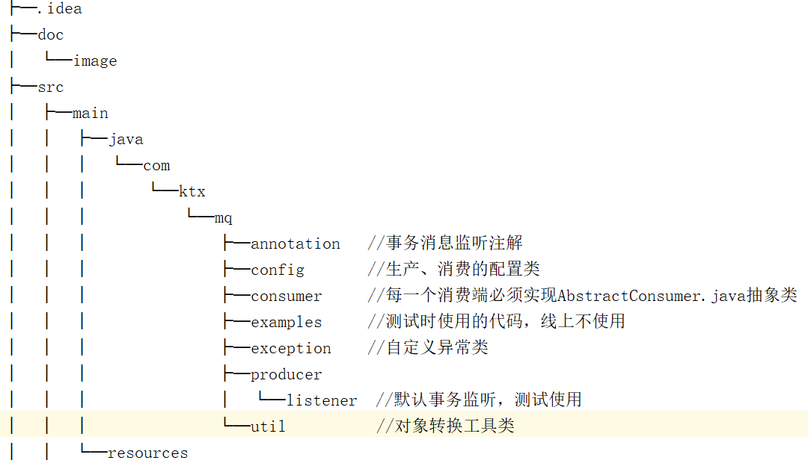
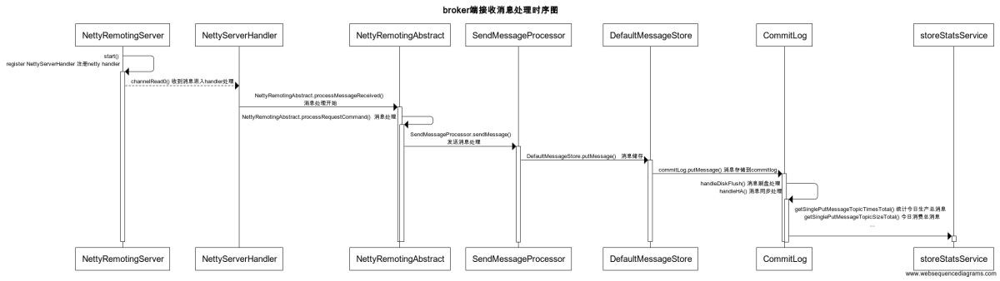
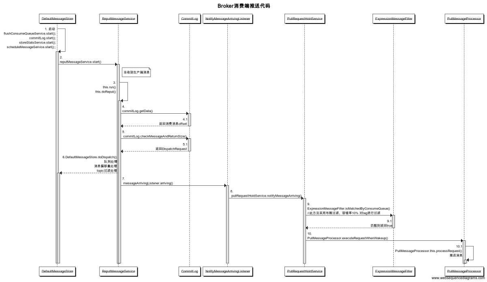
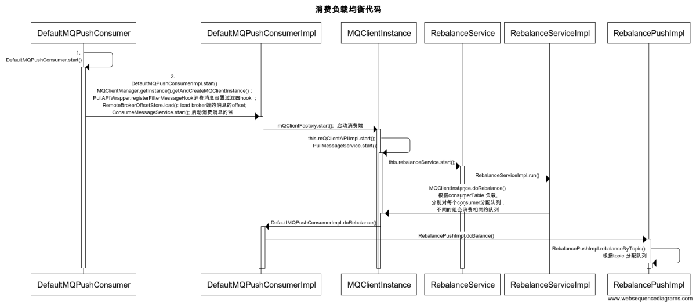

## roketmq 工具包ktx-mq的使用
###代码结构：
      
### 消费端
    1.消费端可以存在一个或者多个，一次继承 AbstractConsumer.java  ，实现config 方法，调用start方法启动
    2.如果与spring集成 必须将com.ktx.mq.RocketMQProcessor 注入spring容器,由于依赖此类目前为注释状态
    
### 生产端
    1. 普通发送消息一般情况一个容器只存在一个(group 决定存在多少个producer)，new RocketMQProducer.java   
       设置producerConfig，调用start方法启动
       1.1 事务消息则调用rocketMQProducer.createAndStartTransactionMQProducer(), 
            参数transactionListener需要手动传入,注意group必须唯一
    1.2 与springboot集成
        @Bean
        ProducerConfig producerConfig(){
            ProducerConfig config = new ProducerConfig();
            config.setNameServerAddr("localhost:9876");
            config.setGroup("groupA");
            config.setInstanceName("instance-A");
            return config;
        }
        @Bean
        RocketMQProducer producer(){
            RocketMQProducer producer = new RocketMQProducer();
            producer.setConfig(producerConfig());
            return producer;
        }
    2. 事务消息可能存在多个，不同的业务需要实现不同的事务监听，必须实现TransactionLinsterer.java 接口
       必须在实现类上添加@MQTransactionLinsenter注解
    2.1 与spring集成， 必须将com.ktx.mq.RocketMQProcessor 注入spring容器

### 与springboot集成 关于MQconfig配置 
    自行创建MQProperties类，该类包含producerConfig 、consumerConfig

## rocketmq 消费问题
  
### 问题1：两个消费者，group和topic相同，tag不同，如果不同的消费者消费不同的tag 则会导致消息部分消息无法消费
      如： 同一group 、topic下，有发送短信（tag-sms ）、有发送邮件（tag-email) 分别先后启动两个消费端
        将导致tag-sms 无法消费
####原因：最后启动tag-email的消费端的时候，会将订阅信息更新到broker
     rokectmq 根据group 和 topic 进行负载均衡 
     rocketmq broker端支持tag过滤，SQL92 过滤包含布隆过滤 
     参考org.apache.rocketmq.common.protocol.heartbeat.SubscriptionData
     org.apache.rocketmq.broker.filter.ExpressionMessageFilter
#### 方案：不同的业务，不同的topic 尽量不使用tag

### 问题2：不同group、同一topic 消息重复消费问题
####  原因： 
    不同的组订阅的队列可能是相同的，消费端更新offset到broker端延时
####  方案： 
    消费端保证幂等性

### 参考：代码调用时序图
#### broker 消息接收时序图
      
#### broker 消息推送 时序图
      

#### 消费端负载均衡 时序图
      
            
      
  
   